# 麻雀成績 使い方ガイド

幹事から届いたリンクを開けば、インストールせずに使えます。まずは自分の成績を見てみましょう。点数を入れるときは第2章を開いてください。

画面例のコミュニティ名と人の名前は、説明用の見本です。

# 1. 自分の成績を見る

## 自分のカードを探す

1. 幹事から届いたリンクを押します。［画面：届いたリンク］
2. 画面上部の「成績」を押します。［画面：stats.jpg］
3. グラフの下に並ぶカードから、自分の名前を探します。カードは収支の多い順です。［画面：stats.jpg］
4. 自分のカードを押します。［画面：stats.jpg］

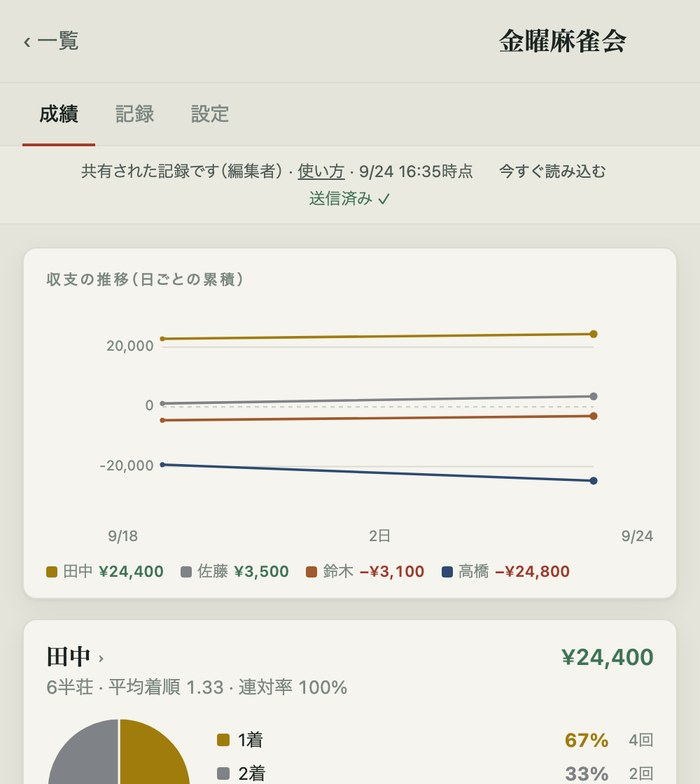

| 場所 | 見られるデータ |
| --- | --- |
| 「成績」の上部 | 日ごとの収支を積み上げたグラフ |
| 自分のカード | 収支、1〜4着の割合、平均着順、連対率、成績ポイントとチップなどの内訳 |
| カードを押した先 | 席ごとの成績、自己ベスト、相手ごとの成績など |

コミュニティ名の横に「閲覧者」と出る人は、見るだけのリンクを使っています。「編集者」と出る人は、点数の入力もできます。

## 打った日を振り返る

1. 「記録」を押します。［画面：records_top.jpg］
2. 日付の一覧から、見たい日を押します。新しい日が上にあります。［画面：records_top.jpg］
3. その日の画面で、見たいタブを押します。［画面：session_open.jpg］

| タブ | 見られるデータ |
| --- | --- |
| 「成績」 | その日の収支、半荘ごとの累積グラフ・着順・ポイント |
| 「精算」 | チップ、祝儀・ペナルティ |
| 「データ」 | その日の一人ずつの内訳、その日のルール |

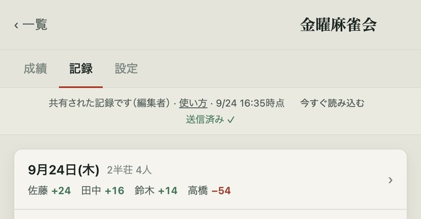

## 新しい記録が見えないとき

見るだけの人の画面は、開いている間、約1分ごとに新しい記録を読み込みます。ほかのアプリから戻ったときも自動で読み込みます。

1. すぐに確認したいときは「今すぐ読み込む」を押します。［画面：viewer.jpg］

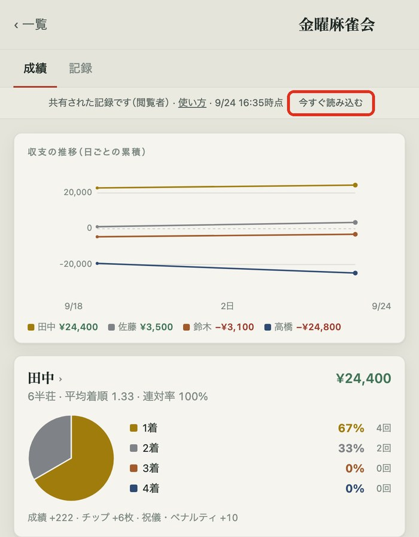

## 次から開きやすくする

記録が表示された画面を開いたまま、ホーム画面に追加してください。アイコンは追加したときのページを覚えます。

LINEの中でリンクが開いた場合：

1. メニューの「ブラウザで開く」を押します。iPhoneではSafari、AndroidではChromeで開きます。［画面：LINEのメニュー］

iPhone（Safari）：

1. 共有ボタン（□に↑）を押します。［画面：Safariの共有ボタン］
2. 「ホーム画面に追加」を押します。［画面：Safariの共有メニュー］
3. 「追加」を押します。［画面：追加を確認する画面］

Android（Chrome）：

1. 右上の「⋮」を押します。［画面：Chromeの右上］
2. 「ホーム画面に追加」を押します。［画面：Chromeのメニュー］

ホーム画面には「麻雀成績」のアイコンができます。iPhoneではSafariとアイコンは別々に動きますが、同じ保管場所から記録を読み込みます。アイコンから記録が出ない場合は、アイコンを消し、届いたリンクを開き直してから追加し直してください。

# 2. 点数を入れる

この章は、コミュニティ名の横に「編集者」と出る人向けです。入力用リンクを持つ人なら、誰でも記録を書き換えられます。人に渡さないでください。

## ① 卓を始める

1. 「記録」を押します。［画面：records.jpg］
2. 「＋ 今日の卓を始める」を押します。［画面：records.jpg］
3. 「今日の記録があります」と出た場合は、同じ卓なら「今日の卓を続ける」を押します。同じ日に別の卓を立てるなら「別の卓として始める」を押します。［画面：今日の記録があるときの選択画面］

日付を変える場合は、その日の画面の上にある日付を押します。［画面：session_top.jpg］

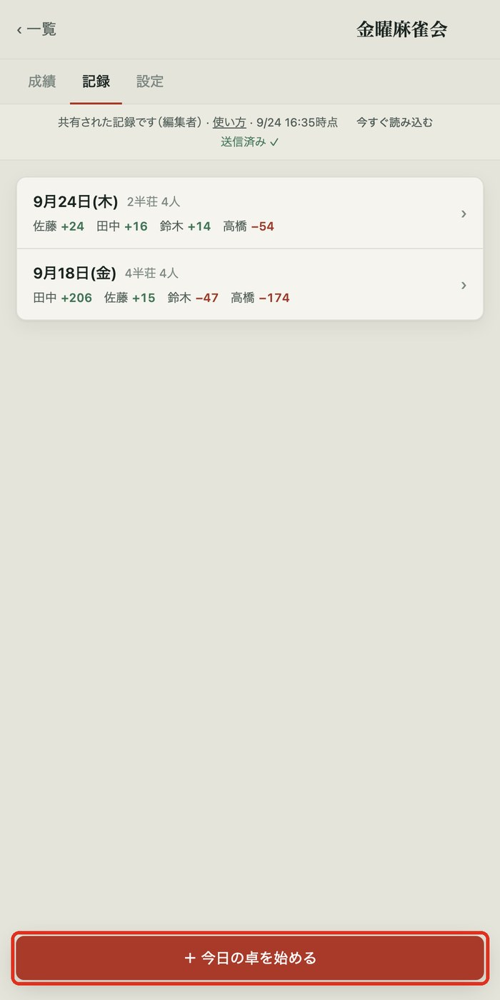

## ② 今日のメンバーを選ぶ

卓を始めると、「今日のメンバー」の画面が開きます。赤い名前が参加メンバーです。

1. 名前を押して参加・不参加を切り替えます。［画面：parts.jpg］
2. いつもの顔ぶれ以外が入る場合は「＋ ゲストを追加」を押します。［画面：parts.jpg］
3. 人数がそろったら「この4人で始める」を押します。［画面：parts.jpg］

ゲストはその日だけの参加で、通算成績には入りません。5人以上を選ぶと、入力画面に「抜け番」が表示されます。

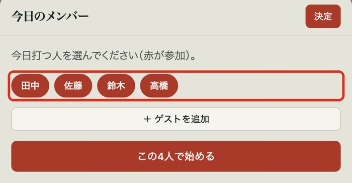

## ③ 半荘の点数を入れる

1. その日の画面で「＋ 半荘を追加」を押します。［画面：session.jpg］
2. 名前の欄で席を選びます。上から東・南・西・北の順です。［画面：sheet_rest.jpg］
3. 席を1つずつ繰り上げる場合は、点数を入れる前に「席を回す」を押します。南の人が東、東の人が北になります。［画面：入力画面の「席を回す」］
4. 終わったときの持ち点を100点単位で入れます。32,700点なら「327」。後ろの「00」は最初から表示されています。［画面：sheet_rest.jpg］
5. マイナスの人は、数字の左の「＋」を押して「−」にします。［画面：sheet_rest.jpg］
6. 3人分を入れたら、必要に応じて「残りを入れる」を押します。最後の一人の点数が自動で入ります。［画面：sheet_rest.jpg］
7. 緑の「合計 100,000 ✓」と、着順・ポイントを確認します。［画面：sheet_done.jpg］
8. 「この半荘を記録する」を押します。［画面：sheet_done.jpg］

合計が違うと「合計が 100,000 になりません」と赤く出ます。点数を見直してください。着順・ウマ・オカ・五捨六入は自動で計算します。

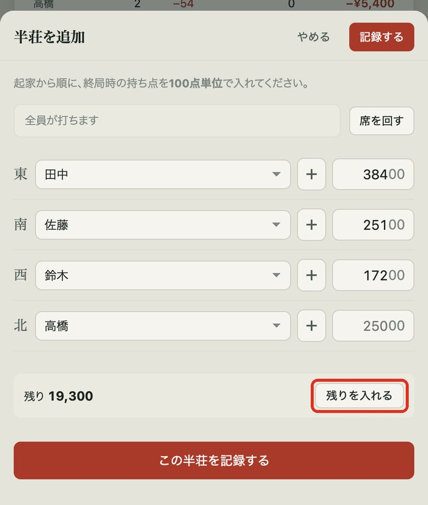
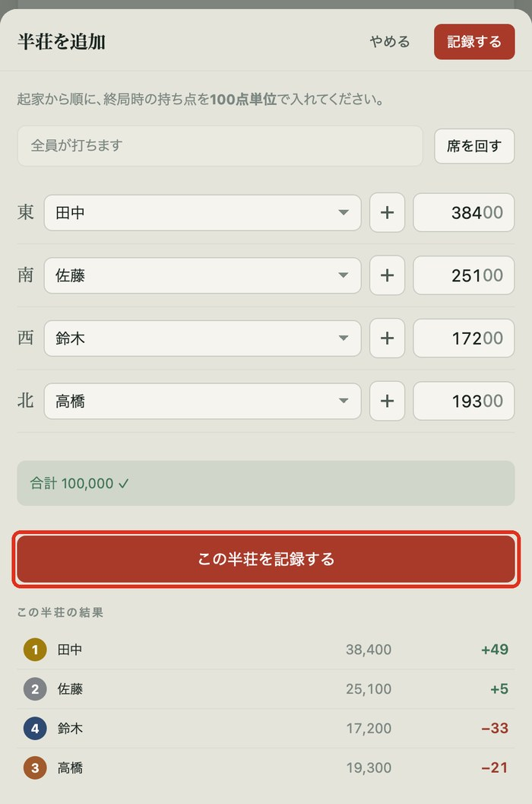

### 飛びが出たら

飛び賞ありのルールで持ち点がマイナスの人がいると、「飛ばした人」の欄が出ます。

1. 「飛ばした人」を選びます。選ばないと記録できません。［画面：sheet_tobi.jpg］
2. 2人が同時に飛んだ場合は、それぞれの「〇〇を飛ばした人」を選びます。［画面：2人が飛んだときの欄］
3. ダブロンなどで自動で分けられない場合は「手動」を選びます。［画面：sheet_tobi.jpg］
4. 「手動」の場合は、「精算」の祝儀・ペナルティにポイントを入れます。［画面：setup.jpg］

通常の飛び賞は自動で移ります。0点ちょうどは飛びになりません。

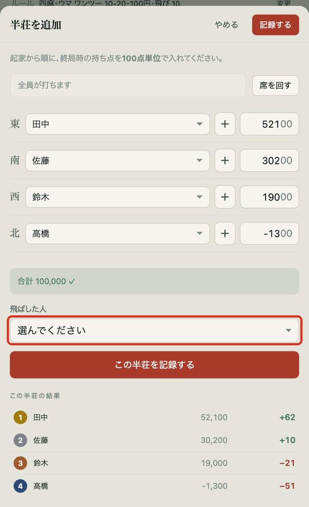

## ④ 記録が届いたか確認する

その日の画面の右上を見ます。［画面：session_top.jpg］

| 表示 | 意味 |
| --- | --- |
| 「送信済み ✓」 | みんなに届いています。 |
| 赤い「未送信」 | まだ届いていません。 |

1. 「未送信」のときは、電波のある所で「今すぐ送る」を押します。［画面：その日の画面の右上］

電波がない所で入れた記録もスマホに残ります。「今すぐ送る」を押さなくても、次にアプリを開いたときに自動で送ります。

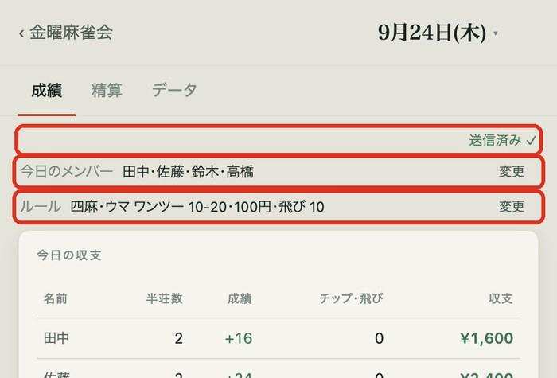

## ⑤ 必要に応じて精算・変更する

### チップ・祝儀・ペナルティ

1. その日の画面で「精算」を押します。［画面：setup.jpg］
2. 各人のチップ欄に、終わったとき**手元にある枚数**を入れます。増減した枚数ではありません。［画面：setup.jpg］
3. 祝儀・ペナルティをポイントで入れます。マイナスは「＋」を押して「−」にします。［画面：setup.jpg］

持ち枚数との差は自動で計算します。「チップ合計」「祝儀・ペナルティ合計」が緑の「✓」なら数が合っています。飛び賞は自動で入るため、手入力は不要です。名前の下に「飛び賞 +10（自動）」のように表示されます。

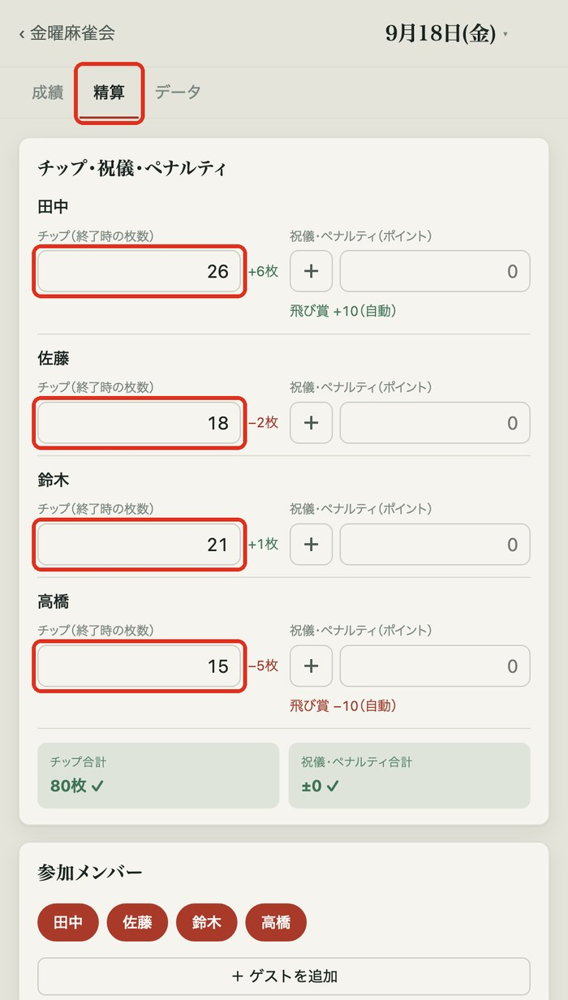

### 途中でメンバーが変わったら

1. その日の画面で、「今日のメンバー」の行にある「変更」を押します。［画面：session_top.jpg］
2. 名前を押して参加・不参加を切り替えます。［画面：parts.jpg］

「精算」の一番下にある「参加メンバー」からも変えられます。すでに打った人は外せません。［画面：setup_members.jpg］

### その日だけルールが違ったら

1. その日の画面で、「ルール」の行にある「変更」を押します。［画面：session_top.jpg］
2. ウマ・レート・チップ・飛び賞など、必要な項目を変えます。［画面：dayrules.jpg］

変更はその日だけです。ほかの日や次の卓には影響しません。人数は変えられません。いつものルールはコミュニティの「設定」で変えます。新しいルールは次に始める卓から適用されます。

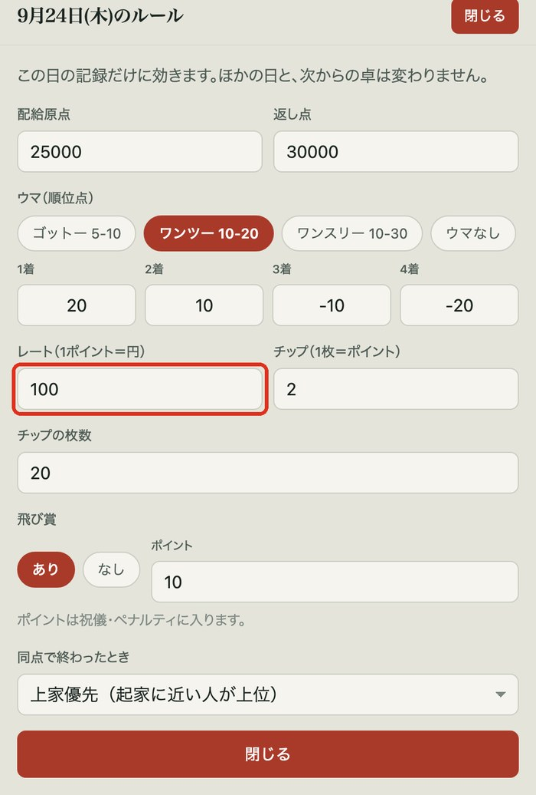

## ⑥ 入力を直す・消す

1. その日の画面で「半荘1 ›」など、直したい半荘を押します。［画面：session_open.jpg］
2. 持ち点を確認して「修正」を押します。［画面：session_open.jpg］
3. 半荘を消す場合は、入力画面の一番下の「この半荘を削除」を押します。［画面：入力画面の一番下］
4. 削除を戻す場合は、9秒以内に画面下の「取り消す」を押します。［画面：削除直後の画面下］

2人が同じ日に入力した記録は両方残ります。同じ半荘を2人とも入れると2件になるため、片方を削除してください。入力係を1人決めておくと安心です。

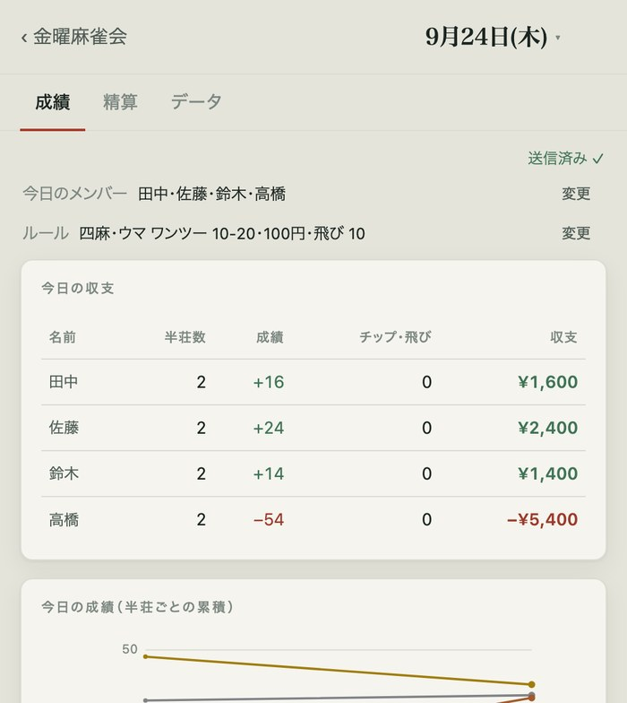

## 困ったとき

| こんなとき | 試すこと |
| --- | --- |
| 「未送信」と出たまま | 電波のある所で「今すぐ送る」を押します。次にアプリを開いたときも自動で送ります。 |
| 入れた記録がほかの人に見えない | 入れた人の画面が「送信済み ✓」か確認します。見る人は「今すぐ読み込む」を押すか、アプリを開き直します。 |
| 同じ半荘が2つある | 片方の半荘を開き、「修正」から「この半荘を削除」を押します。 |
| 「通信できませんでした」と出た | 電波のある所で、届いたリンクかアイコンから開き直します。入れた記録はスマホに残っています。 |
| 「共有された記録を読み込めませんでした」と出た | リンクが古いか、共有が止められている可能性があります。幹事にリンクを送り直してもらってください。 |
| アイコンから開くと記録が出ない | アイコンを消します。届いたリンクを開き直し、記録が出た画面から追加し直します。 |
| マイナスの点数が入らない | 数字の左の「＋」を押して「−」にします。 |
| 席を間違えた | 記録前なら席を選び直します。記録後なら半荘を開いて「修正」を押します。 |

アプリのトップ画面と共有された記録の画面上部にも「使い方ガイド」「使い方」のリンクがあります。

**確認したいこと**

- Androidで「ホーム画面に追加」を押した後に、さらに押すボタンがあるか。
- 「修正」後に、直した点数を確定するボタンの名前。
- ゲストの名前を確定する操作とボタンの名前。
- ルールの変更を確定する操作とボタンの名前。
